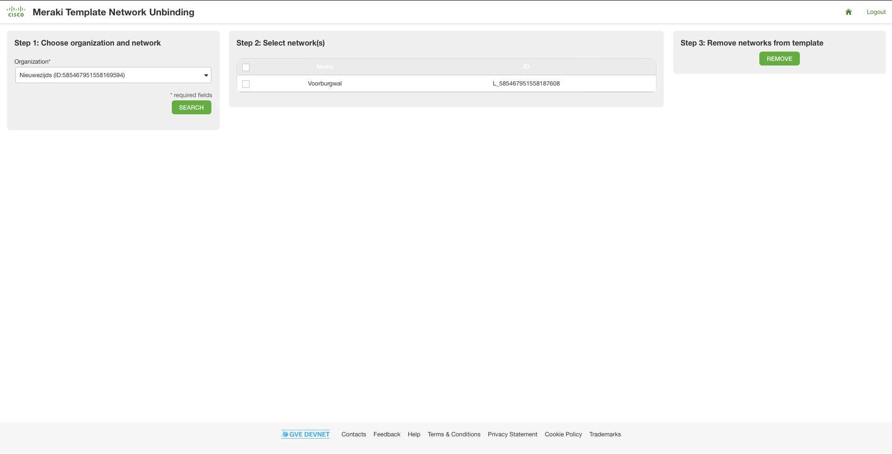

# GVE DevNet Template Network Removal
Unbinding the network from a template for a large number of networks can take a long time and is error-prone. This PoV shows you how to programmatically unbind a large number of networks from a template. You can accomplish in three steps: 

1. Select the organization


2. Select the networks



3. Unbind the networks from the template


## Contacts
* Simon Fang (sifang@cisco.com)
* Stien Vanderhallen (stienvan@cisco.com)

## Solution Components
* Python 3
* Flask
* Meraki Dashboard


## How to obtain a Meraki API Key

In order to use the Cisco Meraki API, you have to enable the API for your organization first. After having enabled API access, you can generate an API key. You can follow the following instructions on how to enable API access and how to generate an API key:

1. Log in to the Cisco Meraki dashboard

2. In the left-hand menu, go to `Organization > Settings > Dasbhoard API access`

3. Click on `Enable access to the Cisco Meraki Dashboard API`

4. Go to `Profile > API access`

5. Under `API access`, click on `Generate API key`

6. Save the API key in a safe place. Please note that the API key will be shown only once for security purposes. In case you lose the key, then you have to revoke the key and regenerate a new key. Moreover, there is a limit of only two API keys per profile. 

> For more information on how to generate an API key, please click here [here](https://documentation.meraki.com/General_Administration/Other_Topics/Cisco_Meraki_Dashboard_API)

> Note: Make sure this API key has write access to both the source and target organization. You can add your account as Full Organization Admin to both organizations by following the instructions [here](https://documentation.meraki.com/General_Administration/Managing_Dashboard_Access/Managing_Dashboard_Administrators_and_Permissions).

## Installation/Configuration

The following commands are executed in the terminal.

1. Create and activate a virtual environment for the project:
   
        #WINDOWS:
        $ py -3 -m venv [add_name_of_virtual_environment_here] 
        $ source [add_name_of_virtual_environment_here]/Scripts/activate
        #MAC:
        $ python3 -m venv [add_name_of_virtual_environment_here] 
        $ source [add_name_of_virtual_environment_here]/bin/activate
        
> For more information about virtual environments, please click [here](https://docs.python.org/3/tutorial/venv.html)

2. Access the created virtual environment folder

        $ cd [add_name_of_virtual_environment_here]

3. Clone this repository

        $ git clone [add_link_to_repository_here]

4. Access the folder `gve_devnet_template_network_removal`

        $ cd gve_devnet_template_network_removal

5. Install the dependencies:

        $ pip install -r requirements.txt

6. Open the `.env` file and add the environment variables. In the sections above, it is explained how to obtain these credentials and variables. Please note that all the variables below are strings.

    ```python
    MERAKI_API_KEY = "<insert_meraki_api_key>"
    ```

## Usage
Now it is time to launch the application! Simply type in the following command in your terminal:

    $ python app.py

Then, head over to the URL that is displayed in the terminal output. 


# Screenshots


### LICENSE

Provided under Cisco Sample Code License, for details see [LICENSE](LICENSE.md)

### CODE_OF_CONDUCT

Our code of conduct is available [here](CODE_OF_CONDUCT.md)

### CONTRIBUTING

See our contributing guidelines [here](CONTRIBUTING.md)

#### DISCLAIMER:
<b>Please note:</b> This script is meant for demo purposes only. All tools/ scripts in this repo are released for use "AS IS" without any warranties of any kind, including, but not limited to their installation, use, or performance. Any use of these scripts and tools is at your own risk. There is no guarantee that they have been through thorough testing in a comparable environment and we are not responsible for any damage or data loss incurred with their use.
You are responsible for reviewing and testing any scripts you run thoroughly before use in any non-testing environment.